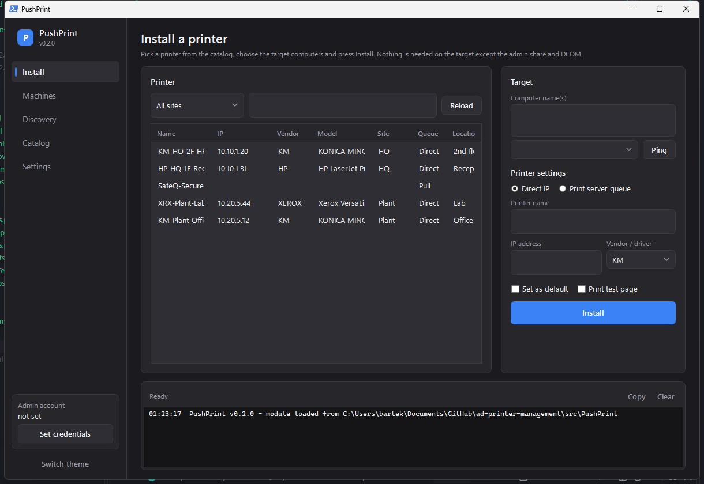

# PushPrint

**Agentless network printer management for Active Directory environments.** Install and remove printers on remote computers without WinRM or an agent, discover what is really on your network, and keep a verified printer catalog. PowerShell module plus a desktop GUI.

[](https://github.com/flaasz/pushprint/actions/workflows/ci.yml)


## Why

Print servers with GPO deployment work until they don't: laptops off-site, sites without a server, Point-and-Print locked down after PrintNightmare, and helpdesk tickets that boil down to "install this printer on that PC". Commercial tools solve it with an agent on every endpoint and a per-printer subscription. This project solves the helpdesk half of the problem with what an AD domain already has: the admin share and DCOM.

- **No agent, no WinRM.** Files go over `\\PC\C$`, execution goes over WMI. Works on any domain-joined Windows 10/11 where the helpdesk account is a local admin.
- **Direct IP or print server.** Push the vendor's universal driver and create a TCP/IP printer machine-wide, or create a per-user Point-and-Print connection inside the logged-on user's session.
- **Discovery that scales to many sites.** Scan by AD site, cross-check SNMP, DHCP and print servers, get flagged for mismatches instead of trusting a generated list.
- **Pull-print aware.** Queues that go through SafeQ, PaperCut, Printix and friends are detected so you do not accidentally bypass accounting with a direct-IP install.
- **Nothing company-specific in the code.** Servers, subnets, drivers and account naming live in `settings.json`.

## Quick start

```powershell
git clone https://github.com/flaasz/pushprint.git
cd pushprint
Copy-Item .\config\settings.example.json .\config\settings.json   # edit: print servers, admin account pattern, drivers
Import-Module .\src\PushPrint

# Build the catalog for one AD site
Invoke-PrinterDiscovery -Site HQ | Save-PrinterCatalog -Merge

# Install a printer on two PCs (prompts once for the admin credential)
Install-RemotePrinter -ComputerName PC-0412, PC-0413 -PrinterName 'KM Office 2F' -PrinterIP 10.1.2.20 -Vendor KM -SetDefault

# Or a print server queue, as a per-user connection
Install-RemotePrinter -ComputerName PC-0412 -PrinterName 'HR-Secure' -PrintServer HQ

# What is on that PC?
Get-RemotePrinter -ComputerName PC-0412 | Format-Table
```

GUI: double-click `src\Gui\PushPrint.cmd`.



## Requirements

| Where | What |
| --- | --- |
| Admin workstation | Windows 10/11, Windows PowerShell 5.1 or PowerShell 7. GUI needs 5.1 or 7 with WPF (Windows only). |
| Target computers | TCP 445 (SMB) and TCP 135 + dynamic RPC (DCOM) reachable; the credential is a local administrator. No WinRM, no agent. |
| Discovery | Read access to print servers; RSAT *DHCP Server Tools* for the DHCP source (optional); SNMP v2c enabled on printers (community `public` by default). |
| Drivers | Vendor universal driver packages extracted under `driverRoot` - see [docs/drivers.md](docs/drivers.md). |

## Configuration

`settings.json` is searched in this order: `-ConfigPath`, `%PUSHPRINT_CONFIG%`, `%APPDATA%\PushPrint\settings.json`, `%ProgramData%\PushPrint\settings.json`, `<repo>\config\settings.json`. Every key is optional; see [config/settings.example.json](config/settings.example.json).

```json
{
  "adminUserPattern": "{domain}\\adm{user}",
  "printServers": { "HQ": "print01.corp.example.com" },
  "pullPrintServers": ["safeq01.corp.example.com"],
  "drivers": { "KM": { "driverName": "KONICA MINOLTA Universal PCL" } },
  "snmp": { "community": "public" },
  "discovery": { "dhcpServers": ["dhcp01.corp.example.com"] }
}
```

`settings.json` and `printers.json` are git-ignored on purpose. They hold your infrastructure.

## Cmdlets

| Cmdlet | Purpose |
| --- | --- |
| `Install-RemotePrinter` | Install a direct-IP printer (driver push) or a print server connection on one or many computers |
| `Remove-RemotePrinter` | Remove a machine printer (and its orphaned port) or a user's connection |
| `Get-RemotePrinter` | List printers on a computer, including the console user's connections |
| `Invoke-PrinterDiscovery` | SNMP + DHCP + print servers, merged by IP, flagged for review |
| `Find-SnmpPrinter` / `Get-PrinterSnmpInfo` | Scan subnets or sites; read model, serial, MAC, status, supplies |
| `Find-DhcpPrinter` | Printer-vendor MACs from DHCP scopes |
| `Get-PrintServerQueue` | Shared queues with Direct / Pull classification |
| `Get-AdSiteSubnet` / `Get-PrinterSite` | AD Sites and Services subnets, IP to site lookup |
| `Get-PrinterCatalog` / `Save-PrinterCatalog` / `Compare-PrinterCatalog` | Catalog read, merge-save, diff |
| `Test-PrinterOnline` | Ping, 9100 and SNMP status for many printers in parallel |
| `Get-PushPrintConfig` | Effective configuration |

Every cmdlet has `Get-Help <name> -Full`.

## How the remote install works

```text
admin PC                                   target PC
--------                                   ---------
Install-RemotePrinter
  |- New-SmbMapping \\PC\C$  ---------->  C:\Temp\PushPrint\{worker.ps1, params.json, KM.zip}
  |- Win32_Process.Create (DCOM) ------>  powershell worker.ps1   (as the admin credential)
  |                                         pnputil /add-driver, Add-PrinterDriver
  |                                         Add-PrinterPort, Add-Printer, default, test page
  |<-- poll result.log / done.txt <------  log lines, exit code
  '- cleanup, result object
```

Print server mode registers a one-off scheduled task in the console user's interactive session instead, because a Point-and-Print connection is per user. Parameters travel as UTF-8 JSON, so printer names with diacritics or spaces are safe. The credential's password is never placed on a command line.

## Development

```powershell
.\build\build.ps1              # PSScriptAnalyzer + Pester
.\build\build.ps1 -Task All    # + zip package in .\out
```

CI runs the same on `windows-latest` under Windows PowerShell and PowerShell 7. Tags `v*` publish a release zip.

Files are UTF-8 **with BOM** (Windows PowerShell 5.1 reads BOM-less files as ANSI). `build\Set-Utf8Bom.ps1` fixes files after editors strip it.

## Roadmap

- Driverless mode using the Microsoft IPP Class Driver (Windows Protected Print compatible)
- SNMP supply-level dashboard and alerts
- Capture default settings (duplex, grayscale) from a reference PC and apply on install
- Intune Win32 package export
- Endpoint agent for devices that are not reachable over SMB/DCOM

Not planned: an end-user self-service portal and floor maps. See [docs/discovery.md](docs/discovery.md) for how the catalog is built and verified, and [docs/drivers.md](docs/drivers.md) for driver packaging.

## License

MIT. See [LICENSE](LICENSE).
